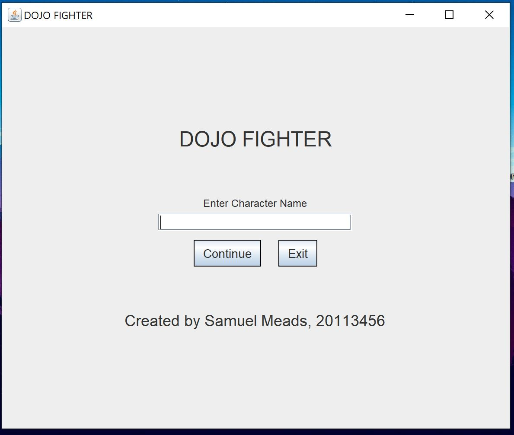

# Dojo Figther
This project is a Java-based, turn-based role-playing game (RPG) with a graphical user interface (GUI). It features random monster encounters, a climactic final boss battle, and a robust save/load system powered by Java Database Connectivity (JDBC).

## Features: 
### Turn-Based Combat:
+ Players and enemies take turns to make their moves, making strategic gameplay crucial.

### Random Monster Encounters: 
+ Players can encounter monsters randomly, keeping the gameplay fresh and unpredictable.

### Final Boss Battle: 
+ A challenging final boss awaits players at the end of their journey.

### Graphical User Interface:
+ An intuitive and attractive GUI for an enhanced gameplay experience.

### Save/Load System: 
+ Players can save their progress at any time and load it later using our JDBC-based system.

## Technologies Used: 
+ Java: The main programming language used to develop the game.
+ Java Swing: Used for building the graphical user interface.
+ JDBC: Used for handling the game's save/load system.
+ MySQL: For persisting game data.

## Getting Started
### Prerequisites:
+ JDK version 8 or later installed on your system
+ A SQL database (MySQL)

## Installation
+ Clone the repo: git clone https://github.com/CarrotInPot/Dojo-Fighter
+ Navigate to the project directory: cd Dojo-Fighter
+ Run the game.

+ ## Screenshots of gameplay:

